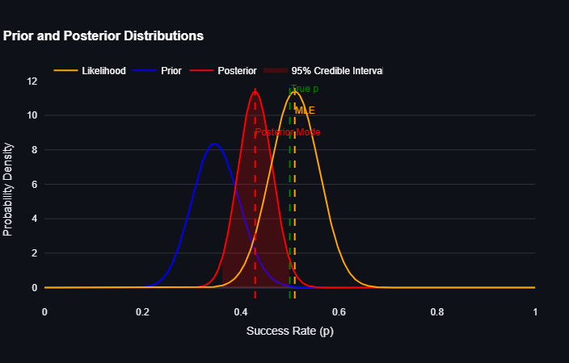

# Bayesian Inference Dashboard: Estimating Success Rates
You can try the app on streamlit servers by clicking the link below:

[](https://hamidabbasi-r-bayesian-inference-main-fjjo4a.streamlit.app/)

This project provides an interactive dashboard for exploring Bayesian inference in the context of estimating success rates (e.g., hit rates, failure rates, or review ratings). The dashboard allows users to simulate data, define prior distributions, and observe how the posterior distribution updates based on observed data. It is built using Python's `streamlit`, `numpy`, `scipy.stats`, and `plotly`.

---

## Table of Contents
1. [Overview](#overview)
2. [Installation](#installation)
3. [Usage](#usage)
4. [Key Features](#key-features)
5. [Figures and Discussions](#figures-and-discussions)
6. [Contributing](#contributing)
7. [License](#license)

---

## Overview

Bayesian inference is a powerful framework for updating beliefs about unknown parameters (e.g., success rates) based on observed data. This project demonstrates how to estimate success rates using:
- A **prior distribution** that encodes initial beliefs.
- A **likelihood function** based on observed binary outcomes.
- A **posterior distribution** that combines the prior and likelihood.

The dashboard is designed to be interactive, allowing users to explore the impact of different priors, sample sizes, and true success rates on the posterior distribution.

---

## Installation

To run this project locally, follow these steps:

1. Clone the repository:
   ```bash
   git clone https://github.com/HamidAbbasi-R/Bayesian-Inference.git
   cd Bayesian-Inference
   ```

2. Install the required dependencies:
   ```bash
   pip install -r requirements.txt
   ```

3. Run the Streamlit app:
   ```bash
   streamlit run main.py
   ```

4. Open the app in your browser at `http://localhost:8501`.

OR alternatively you can run the app using streamlit servers by clicking the link below:

[](https://hamidabbasi-r-bayesian-inference-main-fjjo4a.streamlit.app/)

---

## Usage

The dashboard allows you to interactively adjust the following inputs:
- **True Success Rate (p)**: The underlying probability of success in the simulation.
- **Number of Trials (N)**: The total number of observations or trials.
- **Random Seed**: Ensures reproducibility of synthetic data generation.
- **Mean of Prior Distribution**: The central tendency of the prior belief about $ p $.
- **Strength of Prior Distribution**: The confidence or weight of the prior belief.

By adjusting these inputs, you can observe how the posterior distribution evolves and compare it with the prior and true success rate.

---

## Key Features

- **Interactive Inputs**: Adjust parameters like the true success rate, number of trials, and prior distribution to see their effects on the posterior.
- **Visualizations**: Explore prior, likelihood, and posterior distributions using dynamic plots.
- **Convergence Analysis**: Observe how the posterior mode converges to the true success rate as the number of trials increases.
- **Monte Carlo Simulation**: Simulate multiple datasets to validate the robustness of Bayesian inference.

---

## Figures and Discussions

### Figure 1: Observations and Successes


**Discussion**:  
This figure shows the observed data, where each point represents a binary outcome (success or failure). The true probability of success is denoted by $ p $, which is the parameter we aim to estimate using Bayesian inference.

---

### Figure 2: Likelihood Function


**Discussion**:  
The likelihood function represents the probability of observing the data given a specific value of $p$. It is computed using the binomial distribution:

$$
P(X \mid p) = \binom{N}{k} p^k (1-p)^{N-k}.
$$

This figure highlights how the likelihood peaks at the observed proportion $ \hat{p} = k/N $.

---

### Figure 3: Prior Distribution


**Discussion**:  
This figure shows the prior distribution, which reflects the user's initial belief about the success rate $ p $. The shape and strength of the prior can significantly influence the posterior when data is limited. For example, a strong prior centered at $ p = 0.5 $ will pull the posterior toward 0.5, even if the observed data suggests otherwise.

---

### Figure 4: Posterior Distribution


**Discussion**:  
The posterior distribution combines the prior and likelihood to provide an updated belief about $ p $. This figure demonstrates how the posterior balances prior knowledge with observed data. As $ N $ increases, the posterior becomes more concentrated around the true success rate, reflecting reduced uncertainty.

---

### Figure 5: Convergence of Posterior Mode


---
### Figure 6: Continuous Observations 


---
### Figure 7: Histogram of Continuous Observations


---
### Figure 8: Prior Distribution for Continuous Observations


---
### Figure 9: Log-Likelihood Function for Continuous Observations


---
### Figure 10: Posterior Distribution for Continuous Observations

**Discussion**:  
This figure illustrates how the posterior mode converges to the true success rate $ p $ as the number of trials $ N $ increases. Regardless of the prior, the posterior mode approaches $ p $ due to the law of large numbers. This highlights the robustness of Bayesian inference to prior assumptions when sufficient data is available.

---

## Contributing

Contributions are welcome! If you'd like to improve this project, please follow these steps:
1. Fork the repository.
2. Create a new branch (`git checkout -b feature/YourFeatureName`).
3. Commit your changes (`git commit -m "Add some feature"`).
4. Push to the branch (`git push origin feature/YourFeatureName`).
5. Open a pull request.